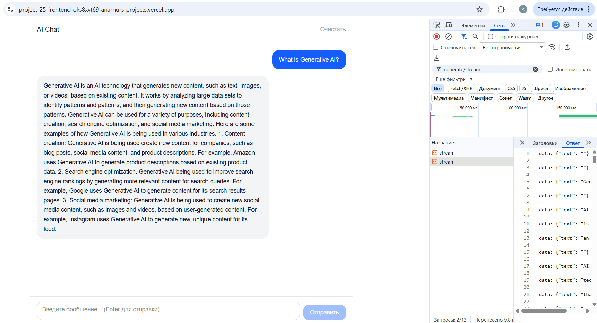

# Project 25 — AI Chat Frontend

Чат-интерфейс для работы с LLM TinyLlama-1.1B. Фронтенд на Next.js подключён к FastAPI бэкенду с поддержкой стриминга токенов в реальном времени.



## 🔗 Ссылки

- **Приложение**: https://project-25-frontend-oks8xvt69-anarnurs-projects.vercel.app
- **Бэкенд API**: https://project23docker-production.up.railway.app

## 🛠 Стек

- Next.js 14/15 (App Router)
- TypeScript
- Tailwind CSS
- FastAPI бэкенд (Project 24) с StreamingResponse
- TinyLlama-1.1B-Chat

## ⚙️ Архитектура

Стриминг реализован через `fetch` + `response.body.getReader()`. Бэкенд отдает токены как поток чистого текста (Plain Text), фронтенд декодирует чанки и дописывает их в состояние, фронтенд обрабатывает поток через ReadableStream, очищает текст от технических тегов и обновляет интерфейс в реальном времени через коллбэк-функцию.Состояние чата хранится в хуке `useChat.ts`.

app/
├── components/
│   ├── ChatWindow.tsx     # список сообщений + автоскролл
│   ├── MessageBubble.tsx  # одно сообщение (user/assistant)
│   └── PromptInput.tsx    # поле ввода + кнопки Send/Stop
├── hooks/
│   └── useChat.ts         # вся логика: state, streaming, AbortController
├── lib/
│   ├── api.ts             # fetch + ReadableStream
│   └── types.ts           # Message, Role, ApiError
└── page.tsx               # главная страница

## 🚀 Локальный запуск

1. Клонируйте репозиторий:
```bash
   git clone https://github.com/anarnur/project_25_frontend.git
   cd project_25_frontend
```

2. Установите зависимости:
```bash
   npm install
```

3. Создайте `.env.local`:

NEXT_PUBLIC_API_URL=https://project23docker-production.up.railway.app

4. Запустите:
```bash
   npm run dev
```

5. Откройте http://localhost:3000

## 🔐 Переменные окружения

| Переменная | Описание |
|---|---|
| `NEXT_PUBLIC_API_URL` | URL задеплоенного FastAPI бэкенда |

## ✅ Реализованные функции

- Визуальное сохранение истории сообщений в окне чата в течение сессии
- Кнопка «Стоп» через AbortController
- Обработка ошибок (сеть, 429, 5xx)
- Автопрокрутка к последнему сообщению
- Адаптивный интерфейс

## «Известные ограничения»

- Отображение стриминга: На текущей инфраструктуре (Railway Hobby) наблюдается эффект буферизации ответов.

- Диагностика: Консоль браузера подтверждает получение чанков, однако из-за отсутствия специфических заголовков (например, X-Accel-Buffering: no) на стороне сервера или прокси, данные приходят блоками.

- Язык: Модель TinyLlama-1.1B оптимизирована для ответов на английском языке.

